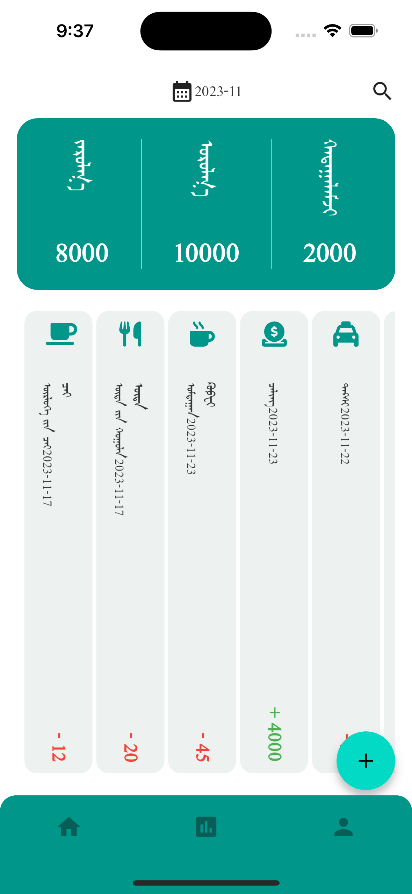
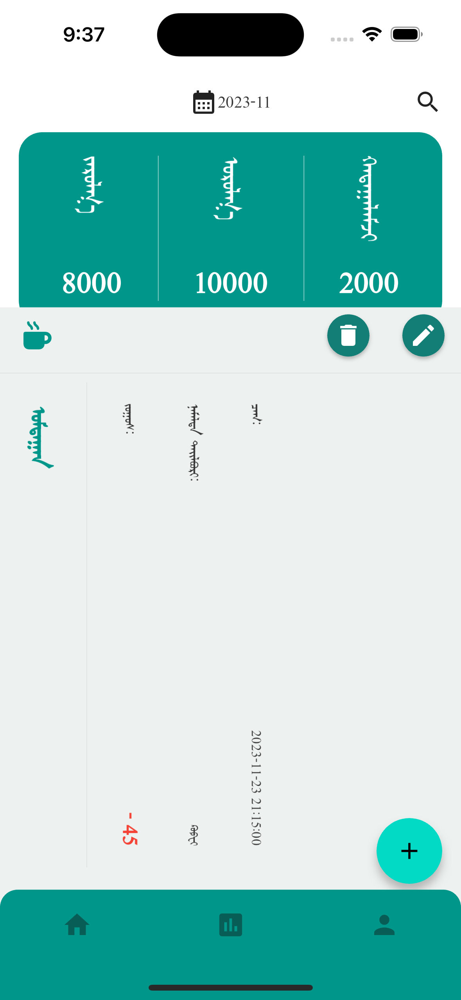
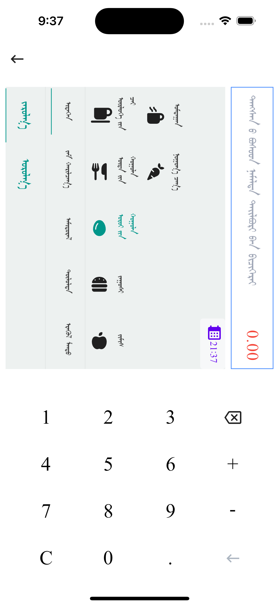
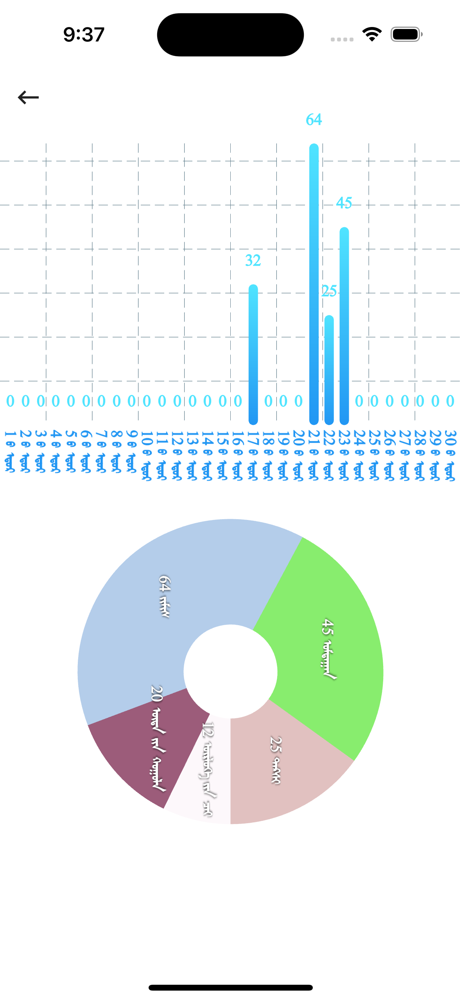
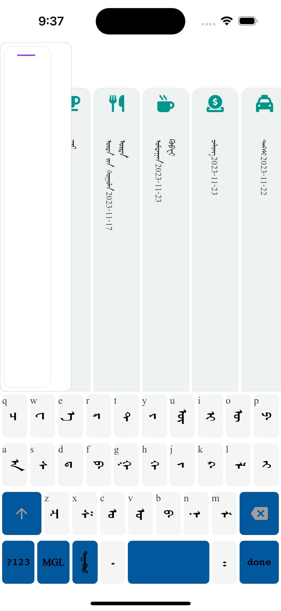

# mgl_finance_app

A Personal Finance Management Flutter APP.

## Mobile App Screenshots

    
    
    
    
    

## Getting Started

This project is a starting point for a Flutter application.

A few resources to get you started if this is your first Flutter project:

- [Lab: Write your first Flutter app](https://docs.flutter.dev/get-started/codelab)
- [Cookbook: Useful Flutter samples](https://docs.flutter.dev/cookbook)

For help getting started with Flutter development, view the
[online documentation](https://docs.flutter.dev/), which offers tutorials,
samples, guidance on mobile development, and a full API reference.

## Credits
Made possible by the following projects:

- [suragch/mongol](https://github.com/suragch/mongol) - Mongolian vertical script widgets for Flutter apps 

## Run Example
1. Install the `clj` command.
2. Init the example `clj -M:cljd init`
3. Open a simulator `open -a Simulator`
4. Run flutter `clj -M:cljd flutter`
